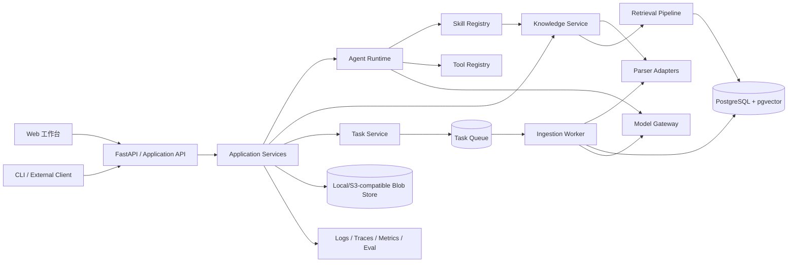

# Agent 驱动的个人知识仓库：项目实施计划

> 文档状态：Draft v1  
> 适用阶段：从方案验证到可演示版本，再到可持续扩展产品  
> 核心原则：先闭环、可评测、可追溯；后扩展、多 Agent、规模化

## 1. 项目定位

### 1.1 一句话目标

构建一个本地优先、来源可追溯的个人知识工作台：用户可导入笔记、论文、课程资料和代码，系统完成解析、索引、检索、问答与整理，并通过标准化 Skill 将稳定工作流复用于更多 Agent 场景。

### 1.2 成功标准

首个可用版本必须完成以下闭环：

1. 用户导入一组真实文档，并能看到解析与索引状态。
2. 用户提出跨文档问题，系统返回有依据的回答和可定位到原文的引用。
3. 用户能打开引用、检查原文，并对回答给出反馈。
4. 文档修改后只更新受影响内容，不产生重复索引。
5. 同一套知识能力可通过 UI、HTTP API 和 Agent Skill 三种入口调用。
6. 核心检索与问答效果有自动化评测结果，而非只靠演示观感判断。

### 1.3 首期非目标

以下能力不应阻塞首个闭环：

- 通用自治多 Agent 社会或无限循环式规划。
- 完整替代 Notion、Obsidian 等编辑器。
- 一开始就支持所有网盘、网页和聊天平台。
- 自研向量数据库、全文搜索引擎或模型训练框架。
- 在缺少数据之前进行模型微调。
- 首期实现复杂的组织级权限、计费和跨地域部署。

这些能力应通过接口和数据模型预留扩展点，但不提前实现。

## 2. 用户与核心场景

### 2.1 主要用户

- 学生：统一检索课堂笔记、教材与课程资料，生成复习提纲。
- 科研人员：关联论文观点、方法、实验结论，追溯证据。
- 开发者：检索代码片段、设计决策、故障记录和解决方案。

### 2.2 首期核心用户旅程

#### 旅程 A：知识摄入

选择本地文件或目录 -> 系统识别新增/修改/删除 -> 解析正文与结构 -> 展示失败项 -> 建立索引 -> 可立即查询。

#### 旅程 B：可追溯问答

选择知识空间 -> 输入问题 -> 系统改写/分解查询 -> 混合检索与精排 -> 生成回答 -> 展示引用与原文片段 -> 用户反馈。

#### 旅程 C：知识整理

选择文档或检索结果 -> 运行“摘要、提纲、概念卡片、观点对比”等 Skill -> 预览结果与来源 -> 用户确认后保存为新知识条目。

#### 旅程 D：增量维护

原文件发生变化 -> 内容指纹识别变化 -> 只重建相关块 -> 原回答引用仍可解析到对应版本，或明确提示来源已更新。

## 3. 产品能力分层

| 层级 | 首期能力 | 后续扩展 |
| --- | --- | --- |
| 交互层 | Web 工作台、流式问答、来源预览、任务状态 | 桌面端、浏览器插件、移动端、IDE 插件 |
| 应用层 | 导入、检索问答、摘要、知识卡片 | 论文综述、课程答疑、写作辅助、复习计划 |
| Agent 层 | 单 Agent 有界工作流、工具调用、状态保存 | Supervisor、专家 Agent、并行任务、人工审批 |
| Skill 层 | 声明式 Skill、版本、测试集、运行记录 | Skill 市场、权限、签名、远程分发 |
| 检索层 | 解析、分块、向量+关键词、精排、引用 | 图检索、多模态检索、个性化排序 |
| 数据层 | 文档、版本、块、任务、会话、反馈 | 多租户、共享空间、生命周期与审计策略 |
| 模型层 | 可替换 LLM/Embedding/Reranker Provider | 本地模型路由、成本/质量自适应、微调模型 |

## 4. 总体架构

### 4.1 推荐架构：模块化单体 + 异步 Worker

首期不采用微服务。API、Agent Runtime、Skill Registry、Knowledge Service 保持清晰模块边界，部署时可先在一个应用进程中运行；耗时的解析、Embedding 和索引任务交给独立 Worker。未来只有在负载、团队边界或隔离需求真实出现时，才按模块拆分服务。



### 4.2 架构原则

1. **领域逻辑与供应商隔离**：LLM、Embedding、Reranker、对象存储和检索后端均通过 Port/Adapter 接口接入。
2. **控制面与数据面分离**：文档元数据、任务、权限、Skill 版本属于控制面；文件正文、索引和模型调用属于数据面。
3. **任务可恢复**：摄入与 Agent 执行均使用显式状态，不依赖进程内存完成长任务。
4. **写入幂等**：文件哈希、文档版本和块 ID 保证重复提交不会生成重复知识。
5. **默认有界执行**：限制工具白名单、最大步骤、超时、Token 和费用；敏感写操作需要确认。
6. **回答必须可追溯**：证据不足时拒答或说明不确定性；引用是回答模型的一部分，而不是后处理装饰。
7. **先单 Agent 后多 Agent**：只有当任务能够独立并行、需要不同权限或上下文隔离时才引入多个 Agent。

### 4.3 借鉴成熟方案的方式

- 借鉴 LangGraph 的显式状态图、持久化检查点和人工介入思路，但在项目内保留独立的 Runtime 接口，避免业务代码绑定具体框架。
- 借鉴 LlamaIndex 的可重复摄入管道思想，将加载、转换、元数据提取和索引拆成可缓存步骤。
- 借鉴成熟搜索系统的多阶段检索：候选召回、融合、精排、上下文构建，而不是一次向量查询直接生成。
- 借鉴 NotebookLM 类产品的来源优先交互：答案旁展示引用，点击可回到原文。
- 借鉴 Obsidian 的本地优先与开放文件理念：原始知识由用户掌控，系统索引可重建。

说明：对闭源产品只参考可观察的产品行为，不假设其内部实现。

## 5. 技术选型建议

### 5.1 推荐基线

| 领域 | 推荐技术 | 选择理由 |
| --- | --- | --- |
| 后端 | Python 3.12、FastAPI、Pydantic | 模型与 RAG 生态成熟，类型化 API 开发效率高 |
| ORM/迁移 | SQLAlchemy、Alembic | 数据模型明确，可演进、可测试 |
| 主数据库 | PostgreSQL 16+ | 事务、全文检索、JSON 和生态完整 |
| 向量检索 | 首期 pgvector | 少一个基础设施，便于本地部署和一致性维护 |
| 关键词检索 | PostgreSQL FTS；中文可接 PGroonga 或独立分词器 | 首期保持统一存储，按中文语料效果再升级 |
| 异步任务 | Redis + Dramatiq/Celery（二选一后固定） | 摄入任务可重试、可观测、可横向扩展 |
| 文件存储 | 本地目录 + BlobStore 接口 | 本地优先，未来可换 MinIO/S3 |
| Agent 编排 | 自有 Runtime 接口 + LangGraph 适配器 | 利用成熟执行能力，同时控制领域契约 |
| 文档解析 | PyMuPDF、python-docx、Markdown parser；复杂 PDF 可选 Docling/Unstructured | 先覆盖高频格式，复杂版面按需接入 |
| 前端 | React、TypeScript、Vite、TanStack Query | 工作台型应用所需的数据流与组件生态稳定 |
| 可观测性 | OpenTelemetry + 结构化日志；开发期可接 Langfuse | 统一跟踪请求、检索、模型调用与任务 |
| 测试 | pytest、Testcontainers、Playwright | 覆盖核心逻辑、真实依赖与用户旅程 |

### 5.2 可替换策略

- 当单机索引量或检索需求超过 PostgreSQL 的舒适区，再将 `RetrievalStore` 适配到 Qdrant/OpenSearch，不改上层问答接口。
- 模型统一经 `ModelGateway` 调用，禁止在业务模块中直接依赖某家 SDK。
- 中文关键词效果应以项目语料评测决定；未验证前不要承诺特定分词方案。
- 若比赛周期很短，可先用进程内任务执行器完成开发，但接口必须与队列 Worker 一致，正式演示前切到可恢复任务。

### 5.3 不建议的起步方式

- 为体现“自研”而重写图执行、任务队列、向量索引等基础设施。
- 同时引入多个向量库、多个 Agent 框架或多个前端状态库。
- 用 prompt 文本隐式表达所有流程，而不定义结构化状态和输出 schema。
- 把文档全文直接塞入模型上下文，绕过检索与引用验证。

## 6. 模块设计

### 6.1 Knowledge Service

职责：知识空间、数据源、文档版本、解析、分块、索引、检索、引用解析。

建议接口：

```text
create_space(input) -> Space
register_source(input) -> Source
ingest(source_id, options) -> Task
delete_document(document_id) -> Task
search(query, filters, retrieval_profile) -> SearchResult[]
resolve_citation(chunk_id, version_id) -> CitationTarget
```

边界要求：该模块不负责生成最终自然语言答案；它只返回带分数、来源和定位信息的证据。

### 6.2 Agent Runtime

职责：接收目标、维护执行状态、选择 Skill/工具、约束循环、持久化检查点、返回结构化结果。

运行状态至少包含：

```text
run_id, user_id, space_id, objective, messages,
plan, current_step, tool_calls, evidence,
budget, checkpoint, status, error
```

推荐状态机：

```text
CREATED -> PLANNING -> RETRIEVING -> EXECUTING -> VERIFYING -> COMPLETED
                                      |               |
                                      v               v
                                WAITING_APPROVAL    FAILED
```

首期只实现确定性的有限节点。自由规划循环作为后续实验功能，必须受最大步数、预算和工具权限约束。

### 6.3 Tool Registry

每个 Tool 包含：

- 唯一名称和语义版本。
- 输入/输出 JSON Schema。
- 权限等级：只读、写入、外部网络、敏感操作。
- 超时、重试和幂等声明。
- 运行适配器与审计字段。
- 面向模型的精简描述和面向开发者的完整文档。

Tool 调用前做 schema 校验，调用后记录脱敏输入、输出摘要、耗时和错误。不得允许模型直接拼接并执行任意 shell、SQL 或 URL。

### 6.4 Skill Registry

Skill 是有版本的工作流包，不只是一个 prompt。建议目录契约：

```text
skills/
  knowledge_qa/
    skill.yaml          # 标识、版本、权限、入口、兼容性
    workflow.py         # 或声明式 workflow.yaml
    prompts/            # 可版本化模板
    schemas/            # 输入、输出与中间结果
    evals/              # 用例、期望与评分规则
    README.md
```

`skill.yaml` 最少包含：`name`、`version`、`description`、`input_schema`、`output_schema`、`required_tools`、`required_capabilities`、`budgets`、`entrypoint`。

“热加载”首期定义为：扫描受信任目录、校验 manifest、登记新版本，新运行使用新版本，进行中的运行继续固定旧版本。生产环境不加载未经签名或审核的任意代码。

### 6.5 Model Gateway

统一封装：

- Chat/Tool Calling、Embedding、Rerank 三类能力。
- Provider 配置、模型别名和能力探测。
- 超时、重试、速率限制、熔断和降级。
- Token/费用统计与请求追踪。
- 结构化输出校验。
- 敏感数据策略和本地模型路由。

业务代码依赖“能力”而不是具体模型名，例如 `fast_chat`、`reasoning_chat`、`embedding_zh`、`reranker`。

### 6.6 Application API

首期资源：

```text
/api/v1/spaces
/api/v1/sources
/api/v1/documents
/api/v1/ingestion-tasks
/api/v1/search
/api/v1/conversations
/api/v1/runs
/api/v1/skills
/api/v1/feedback
```

长任务返回 `202 + task_id`。流式回答使用 SSE；只有需要客户端双向实时控制时再升级 WebSocket。API 从第一天带 `/v1`，内部事件也必须带 `event_version`。

## 7. 数据模型

### 7.1 核心实体

| 实体 | 关键字段 | 说明 |
| --- | --- | --- |
| User | id, settings | 首期可单用户，但保留 owner 字段 |
| Space | id, owner_id, name, retrieval_profile | 知识隔离、检索配置与权限边界 |
| Source | id, space_id, type, uri, sync_cursor | 文件夹、上传、未来的网页/平台连接器 |
| Document | id, source_id, stable_key, current_version_id | 逻辑文档，不随内容修改而改变 |
| DocumentVersion | id, document_id, content_hash, parser_version, status | 可重建、可审计的版本 |
| Chunk | id, version_id, ordinal, text, metadata, embedding_version | 保存章节、页码、行号等定位信息 |
| IngestionTask | id, source_id, stage, progress, retry_count, error | 可恢复摄入任务 |
| Conversation | id, space_id, user_id | 会话容器 |
| AgentRun | id, conversation_id, skill_version, status, budget | 一次可追踪执行 |
| Evidence | id, run_id, chunk_id, score, rank, usage | 回答与证据的稳定关联 |
| Feedback | id, run_id, type, value, comment | 在线评测信号 |
| EvalCase/Run | dataset_version, config_version, metrics | 离线回归评测 |

### 7.2 ID 与版本规则

- `stable_key` 来自规范化来源 URI，避免同一文件重复注册。
- `content_hash` 基于规范化后的原始内容；配置变化通过 `parser_version`、`chunker_version`、`embedding_version` 单独追踪。
- Chunk ID 可由 `document_version + ordinal + chunk_hash` 派生，保证重试幂等。
- 删除先做逻辑标记并产生索引清理任务；真正清理前保留短暂恢复窗口。
- 所有生成结果记录模型、prompt、Skill、检索配置和证据版本，以便复现。

## 8. 知识摄入管道

### 8.1 标准步骤

```text
DISCOVER -> FINGERPRINT -> PARSE -> NORMALIZE -> ENRICH
-> CHUNK -> EMBED -> INDEX -> VALIDATE -> PUBLISH
```

每一步都应：输入输出明确、可缓存、可重试、可单独观测。只有 `PUBLISH` 后的新版本才对检索可见，避免用户查到半成品索引。

### 8.2 格式支持优先级

1. P0：Markdown、TXT、可复制文本 PDF。
2. P1：DOCX、HTML、代码文件、带目录 PDF。
3. P2：扫描 PDF/OCR、PPTX、图片、网页抓取。
4. P3：Notion/语雀/网盘/文献管理器等连接器。

每种 parser 输出统一 `ParsedDocument`，包含文本、结构节点、页码/行号、标题层级和附件引用。

### 8.3 分块策略

- 默认采用结构感知分块：先按标题、段落、代码块和页分隔，再按 Token 上限切分。
- 保存父子关系和邻接关系，检索命中子块后可扩展父章节或相邻块。
- 论文、课堂笔记、代码分别允许配置专用 chunker，但都输出统一 Chunk schema。
- 首期不要只追求固定字符长度；块大小、重叠率和上下文扩展必须进入评测变量。

### 8.4 增量更新

- 未变化：哈希一致，跳过解析与索引。
- 内容变化：创建新 DocumentVersion，重用哈希相同的块与 Embedding。
- 路径变化：若内容哈希与来源身份可确认，只更新 stable key/URI。
- 删除：从当前可检索集合撤下，异步清理索引与文件。
- parser/chunker/embedding 升级：以版本为条件批量重建，旧版本可回滚。

## 9. 检索与回答链路

### 9.1 多阶段检索

```text
问题分类/查询改写
  -> 权限与元数据过滤
  -> Dense 候选召回 + Keyword/BM25 候选召回
  -> Reciprocal Rank Fusion（或评测选出的融合方法）
  -> Reranker 精排
  -> 去重与多样性控制
  -> 父块/相邻块扩展
  -> Token 预算内的上下文构建
  -> 带引用生成
  -> 引用完整性校验
```

### 9.2 首期检索基线

- 建立三条可对比基线：关键词、向量、混合检索。
- 候选数量、融合参数、精排数量、最终上下文数量均配置化。
- 元数据过滤必须在尽可能早的阶段执行，防止跨空间泄漏。
- 记录每阶段候选与分数，便于诊断“没召回”还是“排序错误”。

### 9.3 回答与引用协议

回答结构建议包含：

```json
{
  "answer": "...",
  "citations": [
    {"evidence_id": "...", "claim": "...", "chunk_id": "..."}
  ],
  "confidence": "high|medium|low",
  "limitations": ["..."]
}
```

生成后校验：引用是否存在、是否属于当前空间、引用文本是否支持相邻 claim、引用是否可定位。证据不足时返回“未在当前知识库找到充分依据”，并展示最相关材料，不编造引用。

## 10. Skill 蒸馏与评测

### 10.1 “蒸馏”的工程定义

首期将 Skill 蒸馏定义为：从成功/失败运行中抽取稳定的任务步骤、工具选择、prompt、schema 和验证规则，并通过版本化评测集持续优化。它不同于模型权重蒸馏。

当积累足够高质量样本，且提示与检索优化达到瓶颈后，才评估微调或真正的模型蒸馏。

### 10.2 蒸馏闭环

```text
收集真实任务 -> 人工标注期望与证据 -> 建立基线
-> 归类失败 -> 修改一个变量 -> 离线回归
-> 小流量/人工验收 -> 发布 Skill 新版本 -> 监控反馈
```

### 10.3 评测集设计

按场景至少覆盖：

- 单文档事实问答。
- 跨文档综合。
- 时间/版本冲突。
- 无答案与诱导幻觉。
- 中文术语、英文论文和中英混合查询。
- 代码与自然语言混合。
- 权限隔离和恶意文档 prompt injection。
- 文档更新、删除后的回归。

首期建议 60-100 个高质量问题，每个问题保存：标准答案要点、支持证据、不可接受内容、难度、标签。演示前冻结一个从未参与调参的 holdout 集。

### 10.4 指标

| 层级 | 指标 |
| --- | --- |
| 解析 | 成功率、文本覆盖率、结构/页码保留率、耗时 |
| 检索 | Recall@K、MRR/nDCG、命中证据率、无答案识别率 |
| 精排 | 相对融合基线的 nDCG 提升、延迟 |
| 回答 | 正确性、忠实度、引用准确率/完整率、拒答准确率 |
| Agent | 任务成功率、平均步骤、工具错误率、恢复成功率 |
| 系统 | P50/P95 延迟、任务吞吐、失败率、Token/费用 |
| 产品 | 首次成功问答时间、引用点击率、反馈通过率 |

LLM-as-judge 只能作为一个信号；关键用例必须结合规则、证据匹配和人工抽检。

## 11. 安全、隐私与可靠性

### 11.1 最低安全基线

- 默认本地存储，模型 Provider 明确显示数据是否会离开本机。
- API Key 进入环境变量或系统密钥存储，禁止写入仓库和数据库明文字段。
- 上传文件限制类型、大小和解压深度；文件名与路径做规范化。
- parser/转换器在隔离进程中运行，设置 CPU、内存和超时限制。
- 检索前做空间权限过滤，生成后再次验证引用归属。
- 外部内容一律视为不可信数据，不能覆盖系统指令或自动取得工具权限。
- 写文件、发送网络请求、删除知识等操作记录审计日志并按风险要求确认。
- 日志对文档正文、prompt、密钥和个人信息进行分级与脱敏。

### 11.2 可靠性设计

- 任务至少一次投递，处理函数幂等。
- 重试采用指数退避，永久错误进入 dead-letter 状态并允许人工重跑。
- 数据库迁移可回滚；索引可从源文件和元数据完全重建。
- 模型不可用时给出明确降级状态，不把基础设施错误包装成“没有答案”。
- 定期备份数据库与原文件清单，并实际演练恢复。

## 12. 前端工作台规划

### 12.1 信息架构

- 左侧：空间、会话与常用 Skill。
- 中部：对话/任务主工作区，支持流式结果和结构化输出。
- 右侧：证据与原文查看器，可跳转页码/章节并高亮引用。
- 数据源页：文件、同步时间、版本、解析状态、失败原因和重试。
- 评测页（开发/管理员）：数据集、配置对比、回归结果和失败样本。

### 12.2 必须实现的状态

空知识库、导入中、部分失败、无检索结果、模型不可用、回答中断、引用失效、任务重试、用户取消。所有长任务显示真实阶段和进度，不使用无限旋转掩盖失败。

### 12.3 可访问性与体验

- 键盘可操作、焦点清晰、颜色不是唯一状态信号。
- 引用编号与证据面板稳定对应，流式输出时避免编号跳动。
- 小屏幕将证据区改为抽屉，确保回答与控件不重叠。
- 不在首屏堆砌功能说明；用户进入后直接看到知识工作台与导入入口。

## 13. 分阶段实施计划

以下以 2-4 人团队、10-12 周为参考；单人实施时保持阶段顺序，按容量缩小并行任务。每个阶段只有达到退出条件才进入下一阶段。

### 阶段 0：需求冻结与基准语料（第 1 周）

**目标**：把抽象目标变为可验证场景。

**任务**：

- 选取 30-50 份脱敏真实材料，包含 Markdown、PDF、代码和中英文内容。
- 定义 3 个主要 persona 和 8-12 条端到端用户故事。
- 人工编写首批 30 个问题及证据，覆盖有答案、跨文档和无答案。
- 建立术语表：Document、Version、Chunk、Evidence、Skill、Tool、Run。
- 记录首批架构决策 ADR：部署方式、数据库、Agent 引擎、模型 Provider。
- 建立隐私和演示数据规范。

**交付物**：需求清单、样例语料、评测集 v0、ADR-001 至 ADR-004、UI 低保真流程。

**退出条件**：团队能用同一套问题判断“回答正确且引用有效”；MVP/P1/P2 边界无歧义。

### 阶段 1：工程骨架与可观测基线（第 1-2 周）

详细工作量评估、启动门禁和分步执行方案见[《阶段 1 实施计划：工程骨架与可观测基线》](stage-1-implementation-plan.md)。

**目标**：建立可持续开发和部署的最小工程底座。

**任务**：

- 初始化后端、前端、Worker、数据库迁移和本地 Compose。
- 定义模块边界、配置加载、错误码、请求 ID 和结构化日志。
- 建立 CI：lint、类型检查、单元测试、迁移检查、前端构建。
- 建立 Provider 接口与一个可用 LLM/Embedding 实现。
- 建立测试替身，CI 不依赖真实付费模型。
- 输出 OpenAPI；实现健康检查和依赖就绪检查。

**交付物**：可一键启动的开发环境、CI、基础监控、贡献说明。

**退出条件**：新环境按文档可启动；一次请求能跨 API、数据库和日志追踪；CI 稳定通过。

### 阶段 2：知识摄入 MVP（第 2-4 周）

**目标**：稳定导入并增量维护首批格式。

详细决策门禁、分步执行方案和遗留修正项见[《阶段 2 实施计划：知识摄入 MVP》](stage-2-implementation-plan.md)。

**任务**：

- ~~实现 Space、Source、Document、Version、Chunk、Task 数据模型。~~ ✅ **已完成（2026-07-18，Step 0/1；R2-01~03 已关闭）**
- 实现 Markdown/TXT/PDF parser 和统一 ParsedDocument schema。
- 实现结构感知分块、内容指纹、Embedding 和索引发布。
- 实现异步状态、进度、重试、取消和失败原因展示。
- 实现同文件重复导入、内容修改、删除与重建流程。
- 编写 parser fixture、幂等测试和故障注入测试。

**交付物**：数据源页面、摄入 API/Worker、可检索索引、解析质量报告。

**退出条件**：样例语料导入成功率达到约定阈值（建议 >= 95%）；重复导入不新增重复块；失败任务可定位和重试。

**已完成的子步骤**：

| 工程 | 内容 |
|------|------|
| 领域实体 | Space、Source、Document、DocumentVersion、Chunk、IngestionTask 及枚举、RetrievalProfile 值对象 |
| 仓库接口 | 6 个 Protocol：CRUD + get_by_source/get_by_stable_key/get_latest/create_batch/delete_by_version |
| ORM 模型 | 6 个 SQLAlchemy 2.0 Mapped 模型，含外键、JSONB、pgvector Vector(768)、IVFFlat 索引 |
| 仓库实现 | 6 个实现类，纯异步，含 domain↔ORM 映射器 |
| 迁移 | `a1b2c3d4e5f6` 创建 6 张表；`b2c3d4e5f6a7` 补齐身份、版本、任务字段与约束，可降级/升级 |
| 配置 | ADR-005 固定 pgvector 维度为 768；维度变化必须通过 ADR、迁移和全量重建 |
| 测试 | 50 个相关领域/ORM/配置/ModelGateway 单元测试 + 21 个数据模型/本地依赖集成测试 |

### 阶段 3：混合检索与评测基线（第 4-5 周）

**目标**：用数据证明检索链路有效。

**任务**：

- 实现关键词、向量和混合三条检索路径。
- 实现元数据过滤、RRF 融合、去重与上下文扩展。
- 接入 Reranker，并允许按 profile 开关。
- 建立离线评测命令与结果持久化。
- 对 chunk size、top-k、融合权重、rerank-k 做小规模对比实验。
- 输出每个失败问题的阶段诊断信息。

**交付物**：`RetrievalStore` 接口、检索 API、评测报告 v1、确定的默认 retrieval profile。

**退出条件**：混合+精排相对最佳单路基线有可复现提升，且 P95 延迟满足项目预算；权限过滤测试全部通过。

### 阶段 4：可追溯问答闭环（第 5-7 周）

**目标**：交付可以真实使用的知识问答体验。

**任务**：

- 实现查询分类/改写、上下文构建和结构化回答。
- 实现引用绑定、完整性校验、原文定位与高亮。
- 实现 SSE 流式输出、取消、重试和会话持久化。
- 实现证据不足拒答与冲突来源提示。
- 实现回答反馈和问题导出到评测集的入口。
- 完成端到端 Playwright 测试与移动/桌面布局检查。

**交付物**：对话工作台、证据查看器、问答 API、评测报告 v2。

**退出条件**：核心用户旅程 A/B 自动化通过；引用可回到正确文档位置；holdout 集达到预定正确性、忠实度与拒答阈值。

### 阶段 5：Agent Runtime 与 Skill 标准化（第 7-8 周）

> 当前实现状态（2026-07-19）：通用基础已通过审查，阶段整体未完成。Step 0～4 和 Step 9
> 可独立部分已落地；运行持久化、`knowledge_qa`、Runtime API/Web、三个知识整理 Skill 和
> 端到端验收等待阶段 2～4 交接。详见
> [阶段 5 实现审查记录](stage-5-implementation-review.md)。

**目标**：将已经验证的知识能力封装为稳定、可复用的 Skill。

详细决策门禁、前序依赖、分步执行方案和验收矩阵见
[《阶段 5 实施计划：Agent Runtime 与 Skill 标准化》](stage-5-implementation-plan.md)。

**任务**：

- 实现 Tool/Skill manifest、schema 校验、注册和版本固定。
- 实现有界状态机、检查点、预算、超时和运行审计。
- 将知识问答封装为 `knowledge_qa` Skill。
- 增加 `summarize_document`、`compare_sources`、`create_review_cards` 三个工作流型 Skill。
- 实现只读/写入权限与写入前确认。
- 实现热加载的兼容性检查和旧版本回滚。

**交付物**：Runtime API、Registry、4 个示范 Skill、Skill 开发模板和契约测试。

**退出条件**：同一 Skill 可从 UI/API/测试调用；运行中升级不会改变已固定版本；失败可从最近检查点恢复。

### 阶段 6：Skill 蒸馏与质量门禁（第 8-9 周）

**目标**：形成可重复的质量改进机制。

**任务**：

- 将评测集扩充到 60-100 例并冻结 holdout。
- 建立 prompt、模型、检索配置和 Skill 版本对比。
- 按“解析/召回/排序/上下文/生成/引用”归类失败。
- 从真实失败样本新增回归用例，禁止只针对单个例子改 prompt。
- 在 CI 或发布流程设置最低质量、延迟和费用门槛。
- 编写 Skill 发布、回滚和兼容性策略。

**交付物**：Eval Dashboard/报告、Skill v1、发布门禁、失败分类手册。

**退出条件**：同一配置重复评测结果稳定；新版本不降低关键指标；所有已知严重失败都有回归用例或明确豁免。

### 阶段 7：可靠性、安全与演示打磨（第 9-10 周）

**目标**：让系统在非理想条件下仍可解释、可恢复。

**任务**：

- 测试模型超时、队列重启、数据库短暂断开、损坏文件和超大文件。
- 完成路径遍历、跨空间检索、prompt injection、危险工具调用测试。
- 增加备份/恢复脚本和索引全量重建演练。
- 完成冷启动和典型语料下的性能剖析。
- 准备固定演示数据与可重复演示脚本，同时保留现场自由提问。
- 完成部署、故障排查、隐私和用户使用文档。

**交付物**：Release Candidate、威胁模型、恢复报告、演示脚本、用户文档。

**退出条件**：P0/P1 缺陷清零；关键故障有明确提示和恢复路径；在全新环境完成一次部署与演示彩排。

### 阶段 8：扩展验证（第 11-12 周，可选）

**目标**：证明架构可扩展，而不是一次性演示工程。

从下列项目中只选 1-2 个：

- 增加一个新数据源连接器，验证 Source/Parser 接口。
- 将检索后端替换为 Qdrant/OpenSearch，运行同一契约与评测集。
- 增加论文综述 Agent，复用知识 Skill，并对写入操作加入审批。
- 增加本地模型 Provider，比较隐私、质量和延迟。
- 增加桌面文件监听，验证持续增量同步。

**退出条件**：扩展不需要修改核心领域模型或已发布 API；契约测试和关键评测继续通过。

## 14. MVP 优先级

### P0：必须完成

- Markdown/TXT/PDF 导入与增量索引。
- 空间隔离、任务状态和失败重试。
- 关键词+向量混合检索、精排可配置。
- 带原文定位的引用问答与拒答。
- Web 工作台的导入、对话、证据查看。
- `knowledge_qa` Skill 契约与版本。
- 离线检索/回答评测和端到端测试。

### P1：显著增强作品完整度

- DOCX/HTML/代码解析。
- 三个知识整理 Skill。
- Skill 热加载与检查点恢复。
- Eval Dashboard、配置对比、用户反馈闭环。
- 本地模型或至少两个 Model Provider。

### P2：展示未来空间

- 图谱/实体关系、多模态 OCR、外部平台连接器。
- Supervisor/专家多 Agent。
- 团队空间、细粒度权限和实时协作。
- IDE/浏览器/桌面客户端。
- 基于高质量轨迹的模型微调或蒸馏。

P0 未达到退出条件时，不应投入 P2。

## 15. 建议仓库结构

```text
/
  apps/
    api/                    # FastAPI 入口与传输层
    worker/                 # 摄入及后台任务入口
    web/                    # React 工作台
  packages/
    domain/                 # 纯领域实体、值对象、Port
    application/            # 用例编排与事务边界
    agent_runtime/          # 状态机、Tool、Skill、检查点
    knowledge/              # 摄入、分块、检索、引用
    model_gateway/          # 模型 Provider 适配
    infrastructure/         # DB、队列、Blob、外部服务适配
  skills/
  evals/
    datasets/
    runners/
    reports/
  tests/
    unit/
    integration/
    contract/
    e2e/
  migrations/
  docs/
    adr/
    architecture/
  deploy/
```

`domain` 不依赖 FastAPI、数据库 ORM、具体 Agent 框架和模型 SDK。是否采用 monorepo 工具应由实际构建复杂度决定，不必为目录结构额外引入重型工具。

## 16. 测试策略

| 测试层 | 重点 |
| --- | --- |
| 单元测试 | 哈希/版本、分块、融合排序、预算、状态迁移、schema |
| 属性测试 | 分块不丢文本、幂等、排序稳定性、非法输入 |
| 契约测试 | Parser、Model Provider、RetrievalStore、Tool、Skill |
| 集成测试 | PostgreSQL/pgvector、队列、迁移、索引发布 |
| Golden 测试 | 固定文档的解析结构与引用定位 |
| Eval | 真实语料的检索、回答、拒答、费用和延迟 |
| E2E | 导入 -> 查询 -> 引用 -> 反馈；更新 -> 重建 -> 再查询 |
| 安全测试 | 越权检索、路径遍历、恶意文档、危险工具、日志泄密 |

测试金字塔中不应让真实模型调用占多数。确定性逻辑用本地测试，少量模型集成测试按计划运行，完整评测在发布前运行并保存模型/配置版本。

## 17. 可观测性与运营数据

每个用户请求生成 `trace_id`，贯穿 API、AgentRun、检索、模型调用和 Worker。至少记录：

- 摄入各阶段耗时、输入/输出数量、失败类型。
- 检索各阶段候选 ID、分数、过滤原因和最终证据。
- 模型 Provider、模型别名、Token、耗时、重试和结构化输出错误。
- Agent 步骤、工具调用、预算、检查点与终止原因。
- Skill/Prompt/检索配置版本和用户反馈。

默认不记录完整私密正文。调试采样必须显式开启、脱敏并设置保留期。

## 18. 主要风险与应对

| 风险 | 早期信号 | 应对 |
| --- | --- | --- |
| PDF 解析质量低 | 页码错位、表格丢失、乱码 | 先分 PDF 类型；保留原页定位；复杂版面启用可替换 parser |
| 中文关键词检索差 | 向量基线始终优于混合 | 建中文评测集；比较分词/PGroonga/OpenSearch 后再迁移 |
| Agent 复杂但无收益 | 步骤多、延迟高、成功率低 | 首期用确定性工作流；只有实证收益才增加自治规划 |
| 回答有引用但证据不支持 | 引用点击后无法验证 claim | 结构化 claim-evidence；生成后校验；纳入引用准确率 |
| Skill 热加载带来供应链风险 | 任意代码可被扫描执行 | 受信目录、manifest 校验、版本固定、签名/审核、隔离执行 |
| 供应商锁定 | 业务代码散落具体 SDK | ModelGateway 与契约测试；保存标准化输入输出 |
| 评测过拟合 | 开发集上升、真实问题无改善 | 冻结 holdout；真实用户反馈；一次实验只改一个主要变量 |
| 范围失控 | P0 未闭环就做多 Agent/图谱 | 阶段退出条件和 P0 门禁；扩展项限制为接口预留 |
| 本地部署复杂 | 新环境启动失败 | 单命令 Compose、迁移自动化、健康检查、固定兼容版本 |

## 19. 架构决策记录（ADR）清单

开始开发前至少完成：

1. ADR-001：模块化单体而非微服务。
2. ADR-002：PostgreSQL + pgvector 作为首期统一存储。
3. ADR-003：Agent Runtime 自有接口与具体执行引擎适配关系。
4. ADR-004：本地优先的数据边界和外部模型策略。
5. ADR-005：文档、版本、块的稳定 ID 与删除语义。
6. ADR-006：Skill manifest、版本兼容和信任模型。
7. ADR-007：SSE 与后台任务协议。
8. ADR-008：何时允许拆分检索服务或引入多 Agent。

每个 ADR 写清：背景、决定、备选方案、后果、重新评估触发条件。

## 20. 发布定义（Definition of Done）

一个版本只有同时满足以下条件才可发布：

- P0 用户旅程在干净环境通过。
- 数据库迁移、备份恢复和索引重建经过验证。
- 评测结果达到已记录阈值，且无未说明的关键回归。
- 回答引用可定位，跨空间与删除数据不会被召回。
- 模型/队列失败有清晰错误和恢复方式。
- 无密钥、真实隐私数据或未脱敏日志进入仓库。
- API、Skill manifest 和主要配置有版本记录。
- 部署、使用、故障排查和已知限制文档完整。

## 21. 扩展路线与触发条件

未来功能以真实触发条件决定，而不是按技术热度加入：

| 扩展 | 触发条件 | 预留点 |
| --- | --- | --- |
| 独立向量/搜索服务 | 数据量、延迟或中文搜索评测证明现方案不足 | `RetrievalStore` Port、统一 Chunk schema |
| 多 Agent | 单 Agent 无法在权限/并行/上下文隔离下稳定完成任务 | Runtime 状态、Skill 契约、消息事件 |
| 知识图谱 | 跨文档实体关系问题占比高且普通检索效果受限 | Entity/Relation enrichment 插件 |
| 多模态 | 真实资料中图表、扫描件造成明显信息缺失 | ParsedDocument 的 block 类型与附件引用 |
| 团队协作 | 出现共享、审批和审计需求 | owner/space/ACL 字段与审计事件 |
| 微调/模型蒸馏 | 有足量高质量轨迹，且 RAG/prompt 优化达到瓶颈 | Eval 数据、运行版本、反馈与隐私同意 |
| 云同步 | 多设备需求被验证 | BlobStore、Source connector、同步游标 |

## 22. 近期执行顺序

项目启动后的前十项任务建议严格按以下顺序：

1. 准备脱敏真实语料与 30 个带证据问题。
2. 明确 MVP 指标阈值和演示设备/网络限制。
3. 完成 ADR-001 至 ADR-004。
4. 初始化 API、Worker、Web、PostgreSQL 和 CI。 ✅
5. 定义核心数据模型与迁移。 ✅ **（2026-07-18）**
6. 打通一个 Markdown 文件的幂等摄入。
7. 建立向量/关键词检索基线与评测命令。
8. 完成引用协议和原文定位，再接入回答生成。
9. 打通导入到引用问答的端到端旅程。
10. 将已验证链路封装为 `knowledge_qa` Skill，然后再增加其他 Skill。

## 23. 参考资料

以下资料用于理解成熟实现中的设计模式；最终选型仍以本项目语料、评测和交付周期为准：

- [LangGraph Overview](https://docs.langchain.com/oss/python/langgraph/overview)：状态化 Agent 编排、持久执行与人工介入。
- [LlamaIndex Ingestion Pipeline](https://docs.llamaindex.ai/en/stable/module_guides/loading/ingestion_pipeline/)：可组合、可缓存的文档转换与摄入管道。
- [Qdrant Hybrid Queries](https://qdrant.tech/documentation/concepts/hybrid-queries/)：稠密/稀疏候选融合和多阶段查询思路。
- [pgvector](https://github.com/pgvector/pgvector)：在 PostgreSQL 中保存与检索向量的实现和索引选项。
- [OpenTelemetry Documentation](https://opentelemetry.io/docs/)：跨组件 traces、metrics 和 logs 的统一可观测标准。
- [OWASP Top 10 for LLM Applications](https://genai.owasp.org/llm-top-10/)：prompt injection、敏感信息泄漏和过度代理等风险分类。

---

本计划的核心取舍是：不把“Agent 数量”和“自研基础设施”当作先进性的证明，而以可追溯回答、稳定摄入、可量化评测和可替换边界作为工程质量的主要证据。
